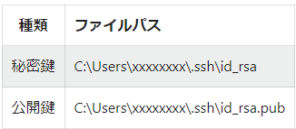
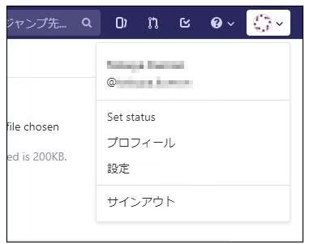
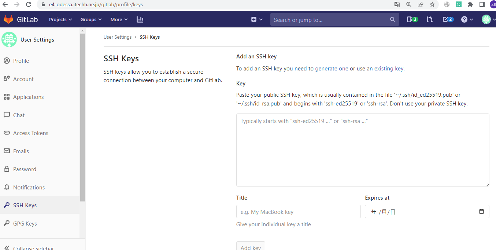

# GitlabへのSSHKey登録

E4管理Gitlab(https://e4-vcs.itechh.ne.jp/gitlab/)を利用する場合は設定不要

## ■手順

### SSH鍵の生成

GitBashを起動しssh-keygenコマンドを実行する

```shell
# Gitbashターミナル

ssh-keygen -t rsa -b 4096 -C "xxxxxxxx@example.com" 
```

> gitlabに登録してあるメールアドレスを使用すること

保存先が表示されるので、問題なければそのままEnterを押す

```shell
# 実行結果

Generating public/private rsa key pair.
Enter file in which to save the key (/c/Users/xxxxxxxx/.ssh/id_rsa):
```

パスフレーズは何も入力せずに、そのままEnterを押す

```shell
# 実行結果

Created directory '/c/Users/xxxxxxxx/.ssh'.
Enter passphrase (empty for no passphrase):
```

再度Enterを押す

```shell
# 実行結果

Enter same passphrase again:
```

以下の表示があれば、SSH鍵生成は完了

```shell
# 実行結果

Your identification has been saved in /c/Users/xxxxxxxx/.ssh/id_rsa.
Your public key has been saved in /c/Users/xxxxxxxx/.ssh/id_rsa.pub.
The key fingerprint is:
SHA256:VJ2U...  xxxxxxxx@pcname
The key's randomart image is:
+---[RSA 4096]----+
|   **E=+=+o+.+..+|
|  o.=.=+.B= = ..o|
| . . + .B..o o ..|
|  . .  .o.  o . o|
|   . .  S  . o  o|
|    .     + o   .|
|         o =     |
|          o      |
|                 |
+----[SHA256]-----+
```

公開鍵、秘密鍵は以下のパスに保存される

> 

### 公開鍵をgitに登録

GitBashを起動し、公開鍵の内容をクリップボードにコピーする

```shell
# Gitbashターミナル

clip < ~/.ssh/id_rsa.pub
```

GitLabにログインし、右上から [設定] を選択する



左側のメニューから [SSH鍵] を選択し、Key欄へ先ほどコピーした公開鍵をペーストする

タイトルには分かりやすい任意の名称を入力する

[鍵を追加] ボタンをクリックして完了



### 設定確認

GitBashを起動しsshコマンドを実行する

```shell
# Gitbashターミナル

ssh -T git@e4-odessa.itechh.ne.jp
```

初回のみ、フィンガープリントの確認を行い信頼済みサイトとしてローカルに保存される

`{暗号化方式} key fingerprint is SHA256:xxxxxxxx` で出力される

以下URLより、フィンガープリントが正しいかどうか確認する

https://docs.gitlab.com/ee/user/gitlab_com/index.html#ssh-host-keys-fingerprints

フィンガープリントは `SHA256:フィンガープリント` の形式で入力する

```shell
The authenticity of host 'e4-odessa.itechh.ne.jp (158.201.254.20)' can't be established.
ECDSA key fingerprint is SHA256:HbW3.........
Are you sure you want to continue connecting (yes/no/[fingerprint])? {yesではなくフィンガープリントの入力を推奨}
Warning: Permanently added 'e4-odessa.itechh.ne.jp,158.201.254.20' (ECDSA) to the list of known hosts.
```

以下の表示があればOK

```shell
Welcome to GitLab, @{アカウント名}!
```
