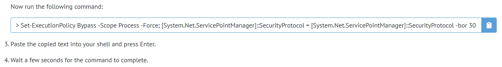
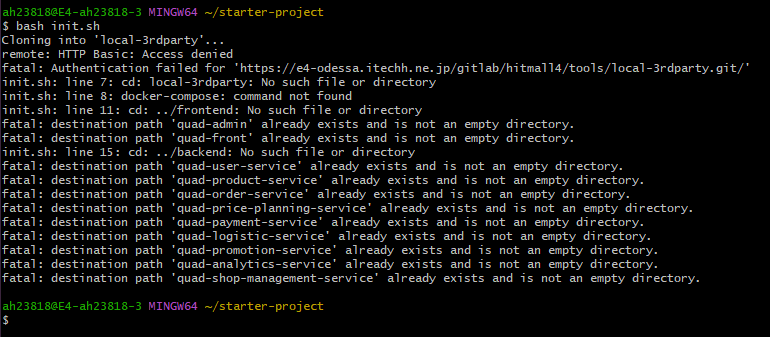

# 開発前提ツール導入

## ■目次

1. PowerShellの実行ポリシー変更
2. Chocolateyのインストール
3. Gitのインストール
4. Dockerのインストール
5. GitlabへのSSH Key登録

## ■ PowerShellの実行ポリシー変更
### PowerShellを管理者権限で実行
- Windowsのスタートボタンを押して「powershell」で検索
- PowerShellのアイコンを右クリック→「管理者として実行」で起動する
> 以降Chocolateyでアプリケーションをインストール場合はPowerShellを管理者権限で実行する必要があるため注意すること

PowerShell実行ポリシーを確認

``` powershell
# PowerShellターミナル

Get-ExecutionPolicy
```

実行ポリシーが`RemoteSigned`でない場合は、以下のコマンドで実行ポリシーを「RemoteSigned」に変更する

```powershell
# PowerShellターミナル

Set-ExecutionPolicy RemoteSigned
```

⇒ [参考情報（WindowsでPowerShellスクリプトの実行セキュリティポリシーを変更する）](https://www.atmarkit.co.jp/ait/articles/0805/16/news139.html)

## ■Chocolateyのインストール
### 前提
- ChocolateyとはWindows用のパッケージ管理ソフトウェアであり、Linuxでいう`apt-get`のWindows版のこと
- ソフトウェアの依存関係を含め簡単にソフトウェアの更新&インストールを管理できる


PowerShellを管理者権限で実行し、[公式サイト](https://chocolatey.org/install#installing-chocolatey)のコマンドをコピぺして実行する  
> コマンドが変更されている可能性があるため、必ず公式サイトにて最新のコマンドを確認すること




完了後にPowerShellを再起動し、以下のコマンドでバージョン番号が表示されればインストール完了

``` powershell
# PowerShellターミナル
choco -v
```
``` powershell
# 実行結果例

choco -v
0.10.15
```
バージョン番号が表示されない場合、PATH設定がされていない状態のため、Windowsの環境変数に手動でChocolateyのPATH設定追加を行う
- 例）`C:\ProgramData\chocolatey\bin`

Chocolateyでインストールしたアプリケーションでも上記事象は発生する可能性があるため、インストール後はPATHが設定されているか確認すること


## ■Gitのインストール

### インストール
PowerShellを管理者権限で実行して、以下のコマンドを実行する

``` powershell
#PowerShellターミナル

choco install git
```
ダウンロード/インストール中に「Y/N」の選択が出た場合は、「Y」を入力する  

完了後にPowerShellを再起動し、以下のコマンドでバージョン番号が表示されればインストール完了

``` powershell
#PowerShellターミナル

git --version
```

```powershell
# 実行結果例

C:\Users\pv66700.ITEC>git --version
git version 2.28.0.windows.1
```
- バージョン番号が表示されない場合はPATH設定を行う  
	- 例）`C:\Program Files\Git`

### 初期設定
gtt configのglobal設定を行う
``` powershell
# PowerSHellターミナル

git config --global core.autocrlf false
git config --global user.name 'Your Name'
git config --global user.email 'Your Email Address'
```

``` powershell
# 設定例

git config --global core.autocrlf false
git config --global user.name '森本 和行'
git config --global user.email 'morimoto-k4@itec.hankyu-hanshin.co.jp'
```

#### HTTPSで初回Gitリポジトリへ接続する場合
`git clone https://hogehoge.git`などのコマンドを使ってHTTPSでGitリポジトリへ接続する場合は、リポジトリを管理するGitlabのユーザーネームとパスワードの入力が求められる（SSHで接続する場合は不要）

GitLabログインと同等の認証なのでメールアドレスとパスワードの入力を行う

この認証に失敗すると下記のような`HTTP Basic: Accsess denied`のエラーログが出力がされる



## ■Dockerのインストール

### インストール
以下の記事の沿ってインストールする
> ! WSLユーザーはイニシャルマンナンバーで登録すること

[/開発ナレッジ/開発環境/docker/dockerDesktop有料化の代替案(wslとdockerインストール手順)  ](http://e4-lhasa.itechh.ne.jp/630889596b1b5f001529b324)

### IPアドレスの動的取得設定
ITEC貸与PCの設定の都合上、Dockerコンテナー内からホストOSを参照するためにはホストOSのIPアドレスで接続する必要がある。

ホストOSのIPアドレスは動的に変更されるため、WSLの環境変数にホストOSののIPアドレスをセットすることでこれに対応する

.profileに下記を追記する。
``` shell
#WSLターミナル

vi ~/.profile
```
``` shell
# 追記内容

export HOST_IP=$(powershell.exe -command ' (Get-NetIPConfiguration | Where-Object {$_.NetProfile.Name -eq "itec.local"}).IPv4Address.IPAddress')
```

## ■GitlabへのSSH Key登録
以下の手順にしたがってGitlabへのSSH Key登録を行う

[GitlabへのSSH Key登録](./01/01_GitlabへのSSH Key登録.md)

設定完了後、任意のリポジトリがSSHでCloneできれば完了
``` shell
# GitBashターミナル

git clone https://e4-vcs.itechh.ne.jp/gitlab/hitmall/hclabo/tools/hclabo-starter-project.git
```

<br><br>
---
次の手順ファイル：[HIT-MALL Ver4開発ツール導入](./02_HIT-MALL Ver4開発ツール導入.md)
