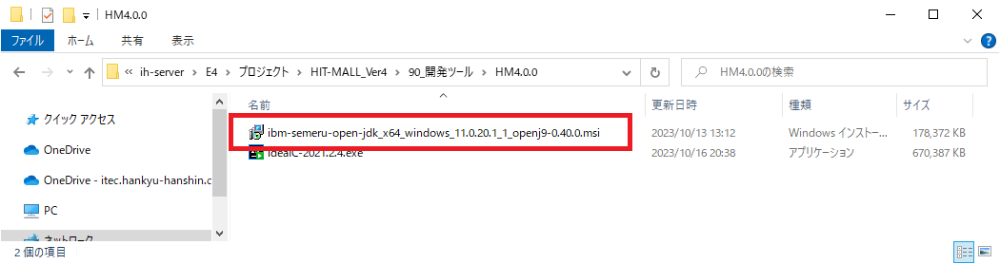
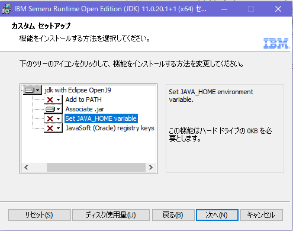
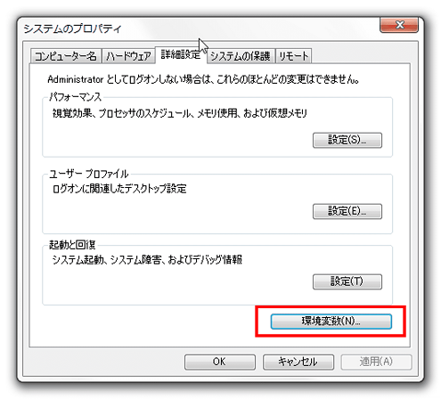
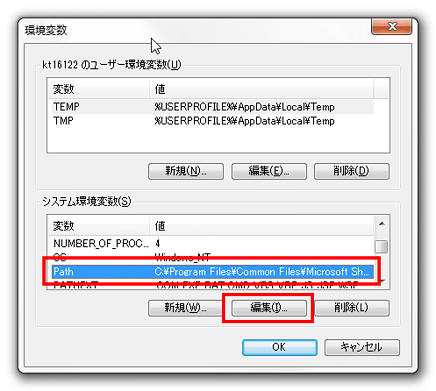
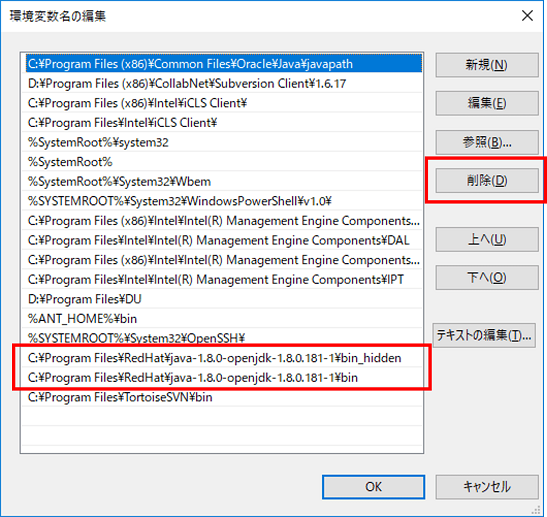
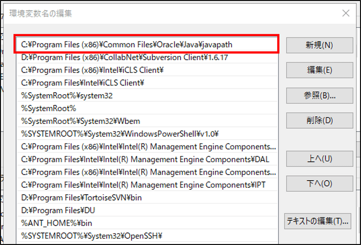
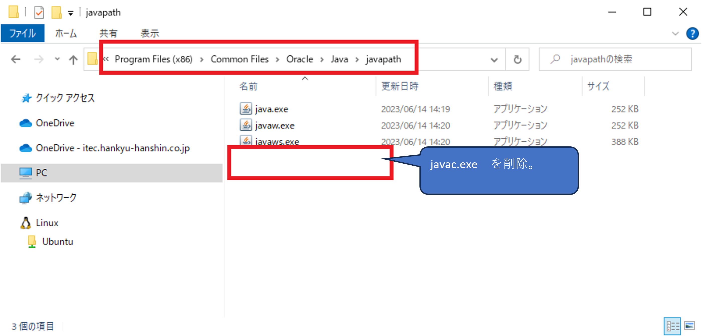

# HIT-MALL Ver4開発ツール導入

## ■目次

1. AdoptOpenJDK11のインストール
2. Mavenのインストール
3. gitからstarter-projectと3rd Praty系ツール、関連プロジェクトをクローン

> 注意）以下の記述は案件によって異なる部分がある

## ■AdoptOpenJDK11のインストール

### インストール

以下より、JDKのインストーラーを取得する

`\\ih-server\E4\プロジェクト\HIT-MALL_Ver4\90_開発ツール\HM4.0.0`



インストール時のカスタムセットアップで「Add to PATH」「SetJAVA_HOME variable」を無効化しておく



インストーラーを起動し画面に沿ってインストールを完了させる

### 環境変数からJavaのPATHを削除する

#### 背景

- HIT−MALLでは各案件・プロジェクトごとにJavaバージョンを指定することを想定している
- 複数の案件・プロジェクトの開発を行う場合、Javaバージョン違いが原因で誤動作を起こしてしまうため、コマンド実行時にPATHを渡すようにする

#### 手順

> インストール時のカスタムセットアップでPATH設定を無効化している場合は省略可

タスクバーの検索フォームに「システム環境変数の編集」を入力し、設定メニューを開く

詳細設定タブの環境変数ボタンを押す



システム環境変数から「Path」を選択し、編集ボタンを押す



インストールしたJDKにパスが通っている場合は設定を削除する



#### Oracle Javaの場合
OracleのJDKをインストールすると共用のシンボリックリンクフォルダーの指定が追加される模様

この場合、PATHの削除は不要だが、javac.exeのシンボリックリンクが存在する場合は不要なため削除しておく

>※下記画像では`C:\Program Files (x86)\Common Files\Oracle\Java\javapath`がシンボリックリンクフォルダーだが、
`C:\Program Files\Common Files`の場合もある





### JavaのPATHの無効化を確認

コマンドプロンプトを再起動しておく
	
javacコマンドでJavaのPATHが無効になっていることを確認する

``` 
# コマンドプロンプト

javac -version
```

``` 
# 実行結果例

'javac' は、内部コマンドまたは外部コマンド、
操作可能なプログラムまたはバッチ ファイルとして認識されていません。
コマンドエラーとなること
```

JDKが起動した場合はPATHが有効になっているいるため、上記手順を見直す

## ■Mavenのインストール

PowerShellを管理者権限で実行して、以下のコマンドを実行する

```powershell
# PowerShellターミナル

choco install maven --version=3.6.3
```

ダウンロード/インストール中に「Y/N」の選択が出た場合は、「Y」を入力する

完了後にPowerShellを再起動し、以下のコマンドでバージョン番号が表示されればインストール完了

> mavenコマンド実行にはJavaのPATH設定が必要になるため注意  
> PATHは案件のJDKバージョン、各自の環境にあわせて変更すること

``` 
# コマンドプロンプト

set JAVA_HOME=C:\Program Files\Semeru\jdk-11.0.20.101-openj9
set PATH=%PATH%;%JAVA_HOME%\bin
mvn --version
```

``` 
# 実行結果例

Apache Maven 3.6.3 (cecedd343002696d0abb50b32b541b8a6ba2883f)
Maven home: C:\ProgramData\chocolatey\lib\maven\apache-maven-3.6.3\bin\..
Java version: 11.0.20.1, vendor: IBM Corporation, runtime: C:\Program Files\Semeru\jdk-11.0.20.101-openj9
Default locale: ja_JP, platform encoding: MS932
OS name: "windows 10", version: "10.0", arch: "amd64", family: "windows"
```

> Mavenバージョンが正しく出力されない場合はPCを再起動する


## ■gitからstarter-projectと3rd Praty系ツール、関連プロジェクトをクローン

Gitbashで、任意のディレクトリにて以下のコマンドを実行する（デフォルトディレクトリは`C:\Users\xxxx.ITEC`）

コマンド実行中の`project name`に任意の文字列を入力すると、その名称のディレクトリが作成され、その配下に関連プロジェクトのクローンと初期設定が実行される（未指定の場合はstarter-projectで実行）

``` shell
# Gitbashターミナル

git clone https://e4-vcs.itechh.ne.jp/gitlab/hitmall/hclabo/tools/hclabo-starter-project.git \
&& cd hclabo-starter-project \
&& bash init.sh
```

3rd Praty系ツール

|No.|名称|備考|
|----|-----------------------------------|----|
|1|local-3rdparty||

関連プロジェクト

|No.|プロジェクト名|日本語名|備考|
|----|-----------------------------------|----|----|
|1|hclabo-admin|管理サイト||
|2|hclabo-front|フロントサイト||
|3|hclabo-user-service|ユーザーサービス||
|4|hclabo-product-service|商品サービス||
|5|hclabo-order-service|受注サービス||
|6|hclabo-price-planning-service|販売企画サービス||
|7|hclabo-payment-service|決済サービス||
|8|hclabo-logistic-service|物流サービス||
|9|hclabo-promotion-service|プロモーションサービス||
|10|hclabo-analytics-service|分析サービス||
|11|hclabo-shop-management-service|ショップ管理サービス||
|12|hclabo-customize-service|兵庫臨床カスタマイズサービス||
|13|hclabo-web-static|静的コンテンツ|IntelliJのプロジェクトに追加の必要なし|


<br><br>
---
前の手順ファイル：[開発前提ツール導入](./01_開発前提ツール導入.md)<br>
次の手順ファイル：[HIT-MALL Ver4初期設定](./03_HIT-MALL Ver4初期設定.md)

