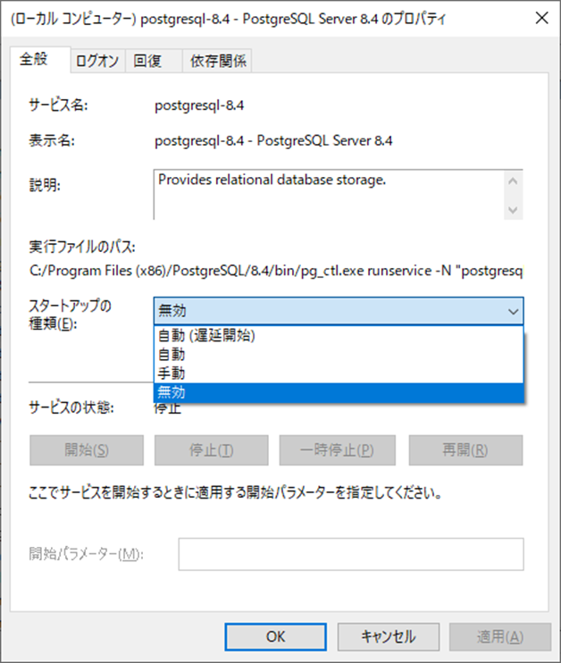

# HIT-MALL Ver4初期設定

## ■目次

1. envファイルの変更
2. ローカル環境の環境依存値の置換
3. 初期ディレクトリ作成
4. 画像ファイルコピー
5. DML/DDLコピー
6. 利用ポート使用可能チェック
7. ローカル証明書のインストール
8. 3rd Praty系ツールの起動
9. 各サービスの OpenAPI Gnerator を実行

## ■envファイルの変更
[HIT-MALL Ver4開発ツール導入](./02_HIT-MALL Ver4開発ツール導入.md)でクローンしたlocal-3rdpartyの`.env`ファイルを任意のエディターで開き、下記のように変更する

```
# 任意のエディター

# Mail
MAIL_ADDR=xxxxx@itec.hankyu-hanshin.co.jp
↓
MAIL_ADDR=(自分のiTECメールアドレス（itec.hankyu-hanshin.co.jp）に修正)

# GMO prefix ex. iTEC man number
PREFIX_GMO=AB12345
↓
PREFIX_GMO=(自分のiTECイニシャルマンNoに修正)
``` 

その他必要に応じて各自のローカル環境にあわせて変更する

## ■ローカル環境の環境依存値の置換
[HIT-MALL Ver4開発ツール導入](./02_HIT-MALL Ver4開発ツール導入.md)でクローンしたlocal-3rdpartyの02_env_replace.shをGitbashで実行する

``` shell
# Gitbashターミナル

sh 02_env_replace.sh
``` 

## ■初期ディレクトリ作成
[HIT-MALL Ver4開発ツール導入](./02_HIT-MALL Ver4開発ツール導入.md)でクローンしたlocal-3rdpartyの03_mkdir.shをGitbashで実行する

``` shell
# Gitbashターミナル

sh 03_mkdir.sh
``` 

## ■画像ファイルコピー
[HIT-MALL Ver4開発ツール導入](./02_HIT-MALL Ver4開発ツール導入.md)でクローンしたlocal-3rdpartyの04_file_copy.shをGitbashで実行する

``` shell
# Gitbashターミナル

sh 04_file_copy.sh
``` 

## ■DML/DDLコピー
[HIT-MALL Ver4開発ツール導入](./02_HIT-MALL Ver4開発ツール導入.md)でクローンしたlocal-3rdpartyの05_db.shをGitbashで実行する

``` shell
# Gitbashターミナル

sh 05_db.sh
``` 
	
## ■利用ポート使用可能チェック

[HIT-MALL Ver4開発ツール導入](./02_HIT-MALL Ver4開発ツール導入.md)でクローンしたlocal-3rdpartyの06_port_check.ps1をWindows PowerShellで実行し、利用するポートが使用されていないかチェックする

``` powershell
# PowerShellターミナル

C:\Users\XXXXXX.ITEC\hclabo-starter-project\hclabo-local-3rdparty>.\06_port_check.ps1
``` 

すでにポートが使われている場合、そのポートを使用しているサービスを停止させる

### サービス停止方法（例：postgres）
* 既存のローカル環境にて既にポート番号「5432」を占有してしまっている場合は、解放が必要
* まずはpostgresのポート番号を確認（pgAdmin3等）  
	- 下記画像の例の場合は、「PostgreSQL 8.4」がポート番号「5432」を占有
	    - 
* 「5432」を利用しているPostgreSQLを停止する
	* サービスの起動（［Windows］+［R］キーを同時押し → 「services.msc」を入力して実行）
	* 対象のPostgreSQLを右クリック → 停止（状態列の実行中の文字が消えたらOK）         
		- 
	* スタートアップの種類列が「自動」になっていると、PC起動時に勝手に起動するのでいったん無効にしておく
		- 右クリック→プロパティ→スタートアップの種類
		- 
               
> 停止したバージョンのPostgreSQLを利用しているローカル環境とVer4を同時に起動させる場合はポートの変更が必要  
> 各案件のenvファイルや接続設定、A5など接続ツールの接続情報などあわせて変更すること


## ■ローカル証明書のインストール

[ローカル証明書インストール](./03/01_ローカル証明書インストール.md)


## ■3rd Praty系ツールの起動

WSLで、local-3rdpartyディレクトリ直下で下記コマンドを実行する

``` shell
# WSLターミナル

docker compose up -d
```

しばらくしたあと、全コンテナーが正常起動しているか確認する

``` shell
# WSLターミナル

docker container ls
```

```
# 実行結果
## 以下8コンテナーが表示され、STATUSがUpになっていること

hclabo-haproxy
default-nginx
default-fluentd
hclabo-postgres
default-mongodb
default-mongo-express
default-rabbitMQ
default-zipkin
```


## ■各サービスの OpenAPI Gnerator を実行
以下の各サービスAPIを任意のディレクトリにクローンし、OpenAPI Gnerator の実行、および、Jarのローカルリポジトリへのインストールを行う

GitLabリポジトリ：https://e4-vcs.itechh.ne.jp/gitlab/hitmall/hclabo/program/openapi-specs/

|No.|プロジェクト名|日本語名|備考|
|----|-----------------------------------|----|----|
|1|hclabo-user-service-openapi|ユーザーサービスAPI||
|2|hclabo-product-service-openapi|商品サービスAPI||
|3|hclabo-order-service-openapi|受注サービスAPI||
|4|hclabo-price-planning-service-openapi|販売企画サービスAPI||
|5|hclabo-payment-service-openapi|決済サービスAPI||
|6|hclabo-logistic-service-openapi|物流サービスAPI||
|7|hclabo-promotion-service-openapi|プロモーションサービスAPI||
|8|hclabo-analytics-service-openapi|分析サービスAPI||
|9|hclabo-shop-management-service-openapi|ショップ管理サービスAPI||
|10|hclabo-customize-service-openapi|兵庫臨床カスタマイズサービスAPI||

実施手順は、[兵庫臨床カスタマイズサービスAPIのREADME.md － Windows環境での実行](https://e4-vcs.itechh.ne.jp/gitlab/hitmall/hclabo/program/openapi-specs/hclabo-customize-service-openapi/-/blob/master/README.md) を参照

<br><br>
---
前の手順ファイル：[HIT-MALL Ver4開発ツール導入](./02_HIT-MALL Ver4開発ツール導入.md)<br>
次の手順ファイル：[開発補助ツール導入](./04_開発補助ツール導入.md)

