# IntelliJでのプロジェクト設定

## ■はじめに

こちらの

- [01_開発前提ツール導入](../01_開発前提ツール導入.md)
- [02_HIT-MALL Ver4開発ツール導入](../02_HIT-MALL Ver4開発ツール導入.md)
- [03_HIT-MALL Ver4初期設定](../03_HIT-MALL Ver4初期設定.md)
- [04_開発補助ツール導入](../04_開発補助ツール導入.md)<br>

の手順に則って本資料の作業を進める

## ■準備

### IDEのインストール

#### IntelliJ IDEACommunity Edition（ITECメンバー）  

- 以下より `2021.2.4` の `Community Edition` 版を取得

    ``` shell
    \\ih-server\E4\プロジェクト\HIT-MALL_Ver4\90_開発ツール\HM4.0.0
    ```

    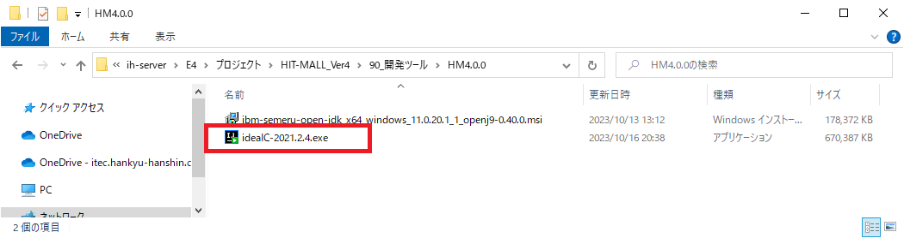

- 取得したファイルを実行してインストール（選択肢はデフォルト状態でOK）

#### IntelliJ IDEA Ultimate （Ultimateライセンスを持つVTIメンバーのみ）

- 以下より `2021.2.4` の `Ultimate` 版をダウンロード
    - https://www.jetbrains.com/idea/download/other.html
- DLしたファイルを実行してインストール（選択肢はデフォルト状態でOK）
- ライセンス情報はVTI自社で確認すること

---

### インストール後の注意点

以降、決してintelliJのアップデートはしないこと
※自動アップデートはされないはずだが、「intelliJ IDEA 20XX.X.Xが入手可能」のような通知が着たときクリックしないように！

理由

- intelliJ 2021.3.3以降では、プロジェクトを更新するとエンコーディングが「ISO-8859-1」への上書きが発生する
- これにより、Ver4のUtilクラスで定義しているHiraganaKatakanaConversionUtility.javaでビルドエラーが起きてしまう
- 手動で文字コードを「UTF-8」に更新してから再度ビルドを行う手間を省くために2021.2.4版を採用する

## ■IntelliJの初期設定

### ソースプロジェクトを開く

※ソースは「[HIT-MALL Ver4開発ツール導入](../02_HIT-MALL Ver4開発ツール導入.md)」の手順でクローン済

1つのIntelliJで全ファイルを開く方法

hclabo-starter-projectを開く(※画像内のstarter-projectを置き換えてみてください)

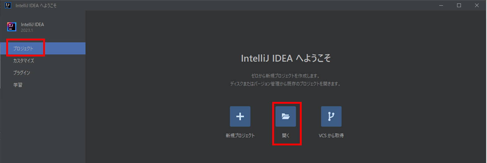
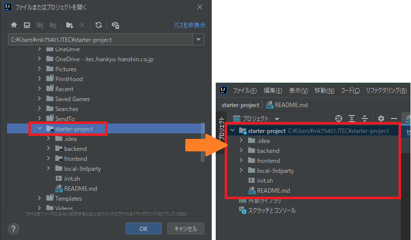

2つのIntelliJで frontend、backendを開く方法

frontendを開く


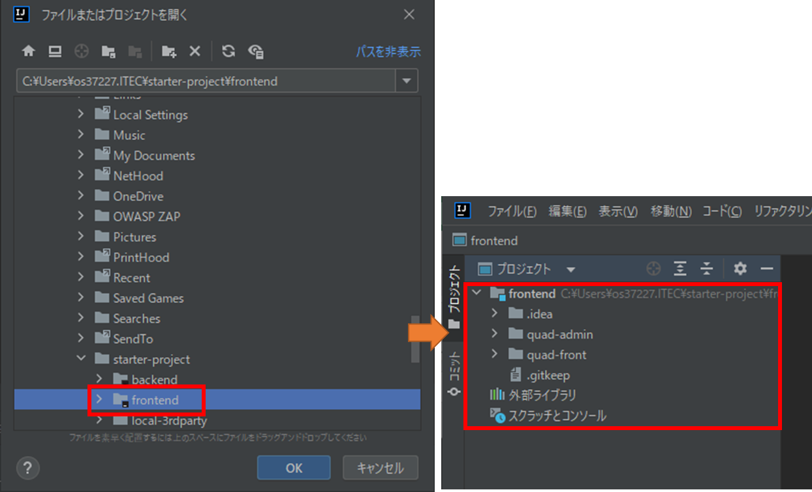

続けてbackendを別ウィンドウで開く

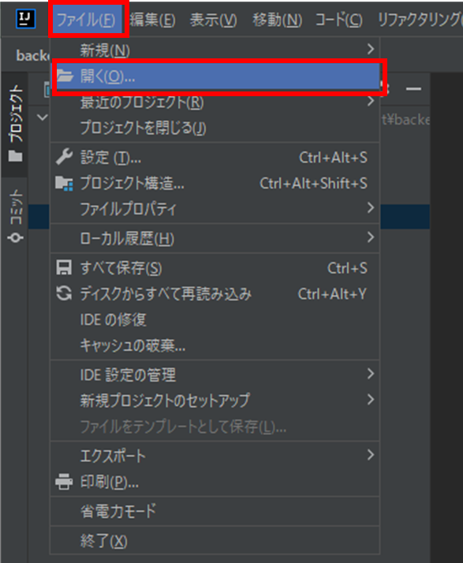
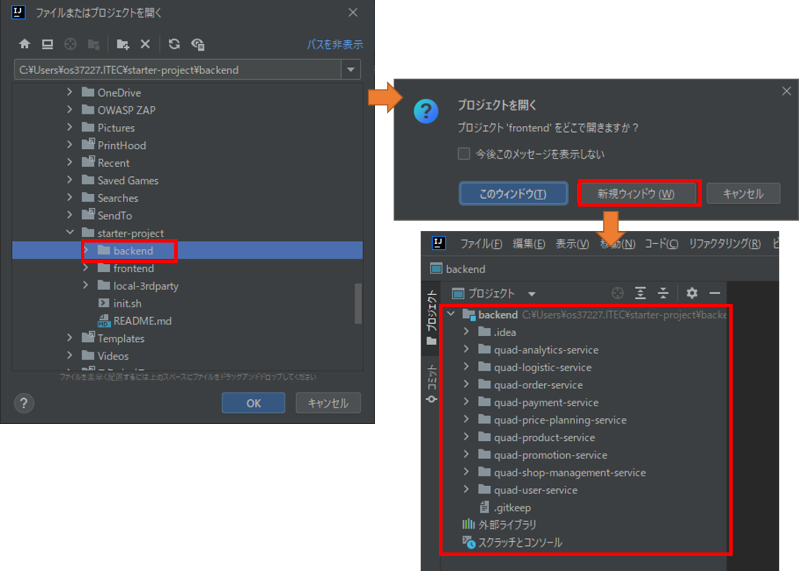

念のためpullで最新化しておく  
> ※1つずつ選択して実行が必要（複数選択できるが、pullは1件しか実行されないため）

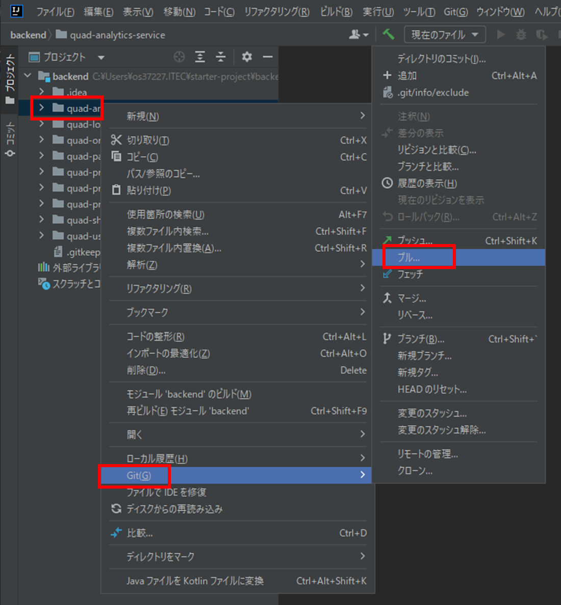
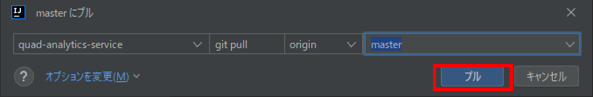

---

### JDK設定

ファイル ＞ プロジェクト構造 ＞ プロジェクト設定 ＞ プロジェクトからインストールしたJDKを設定する（言語レベルはデフォルトでOK）  
> frontend、backendの両方で実施

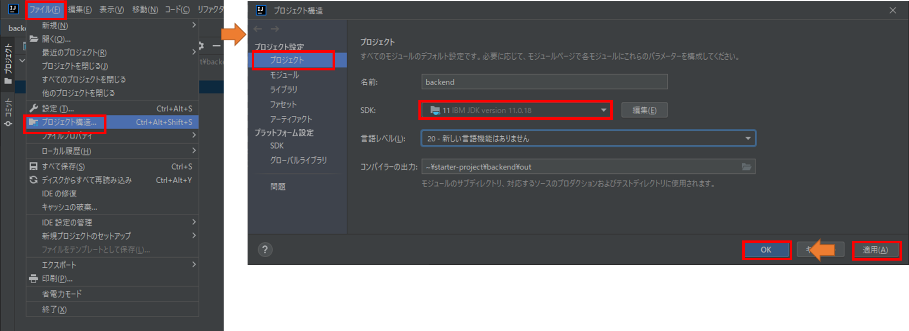

---

### フォーマッター設定
#### 設定手順

ファイル ＞ 設定 ＞ エディター ＞ コードスタイル ＞ Javaを選択し、下図項目スキームに「プロジェクト」を設定

歯車ボタン ＞ スキームのインポート ＞ IntellJ IDEA コードスタイル XMLを押下
> frontend、backendの両方で実施

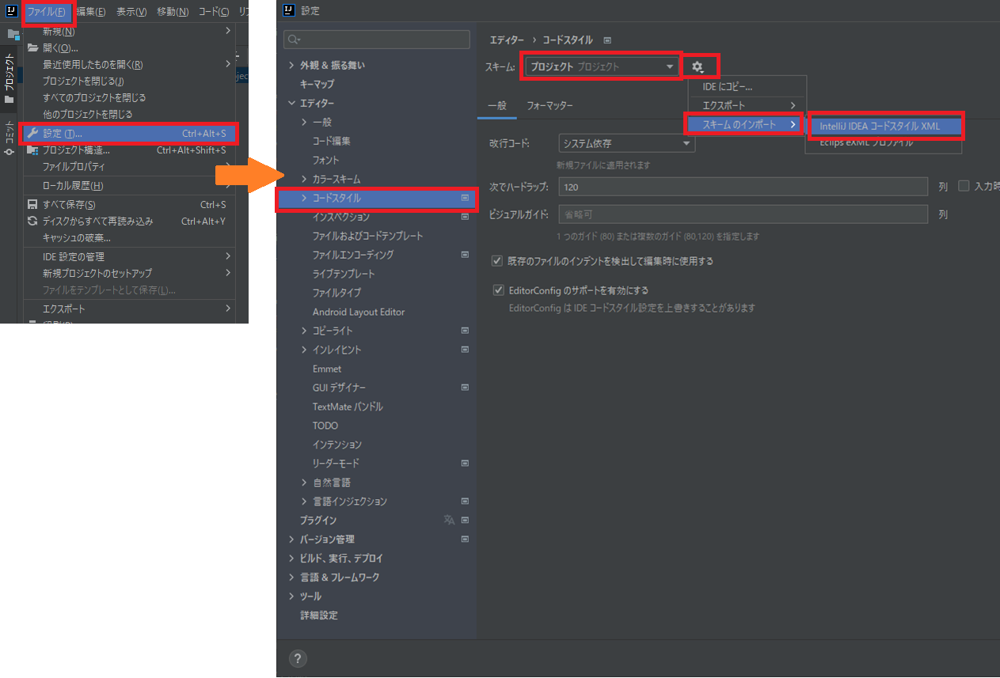

HM40_CodeFormatter.xmlを選択して、現在のスキームにインポートする

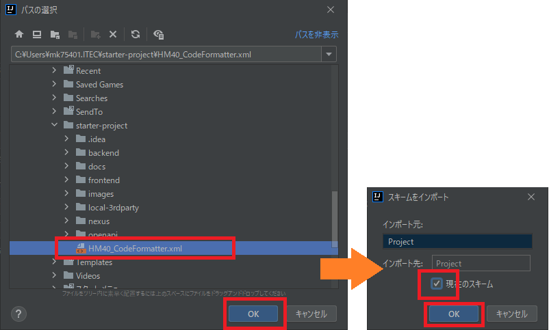

#### 実行手順

- フォーマット実行

    フォーマットしたいソースファイルあるいは、フォルダを右クリックし、下記画像の要領で実施する

    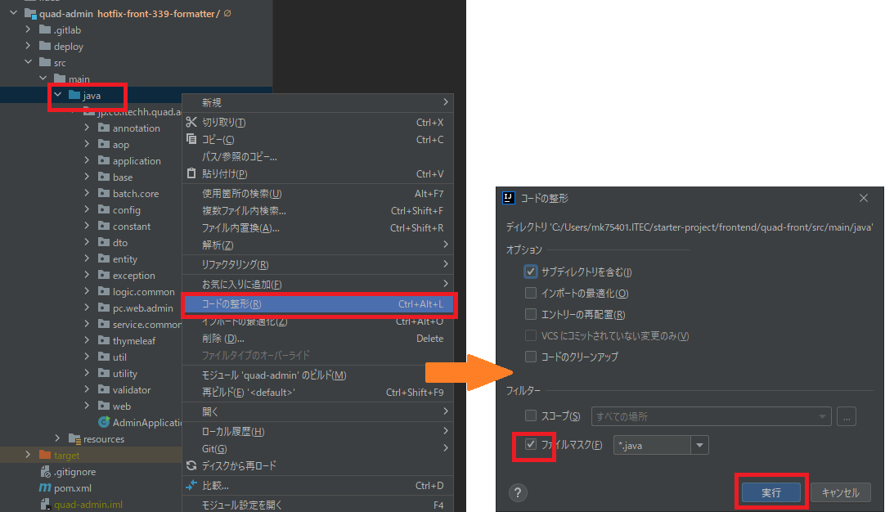

- 保存時にコードを自動的に再フォーマット

    ファイル ＞ 設定 ＞ ツール ＞ 保存時のアクションを選択し、下図項目コードの整形にチェックを入れる

    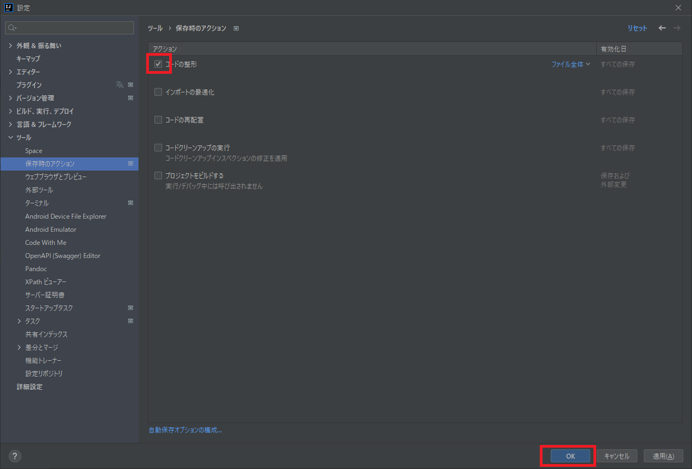


---

### 問題警告（インスペクション）設定
#### 設定手順

ファイル ＞ 設定 ＞ エディター ＞ インスペクションを選択

歯車ボタン ＞ プロファイルのインポートを押下
> frontendで実施

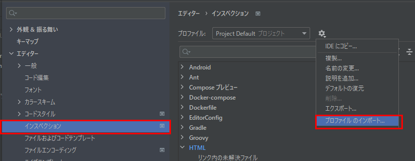

HM40_Project_Default.xmlを選択して、インポートする

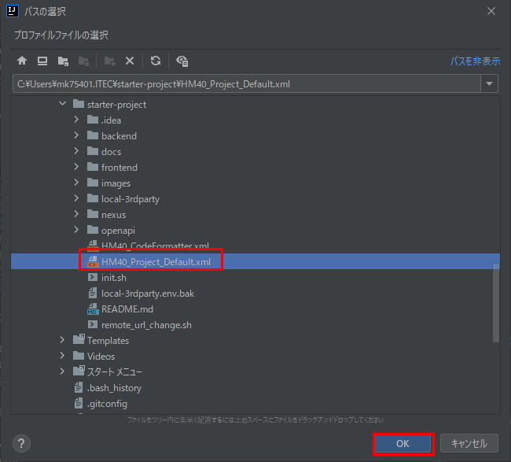

インポートの結果、下記の点を確認する  
HTML ＞ 不明なタグ   
　　画面右下、カスタムHTMLタグに`hm:freearea`が追加  
XML ＞ バインドされていない名前空間接頭辞  
　　チェックされていない

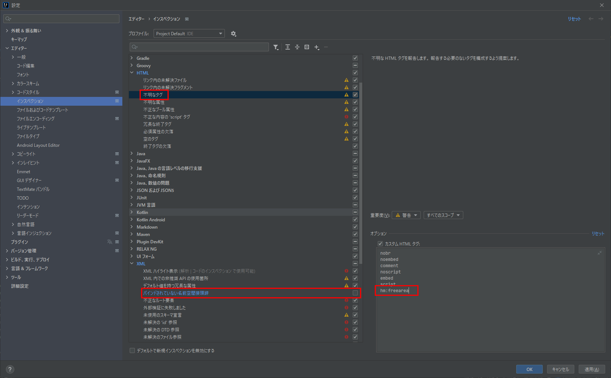


---

### 末尾空白行設定

ファイル ＞ 設定 ＞ エディター ＞ 一般を選択  
ダイアログ右側の下部　保存時の項目を下記画像の要領で設定

> frontend、backendの両方で実施

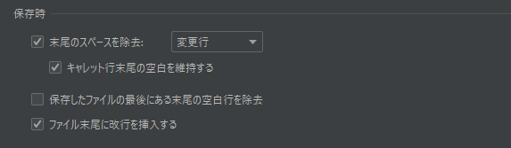


---

### ライブラリ取得

コマンドプロンプトでhclabo-payment-service配下に移動し、下記コマンドを実行  

> mavenコマンド実行にはJavaのPATH設定が必要になるため注意  
> PATHは案件のJDKバージョン、各自の環境にあわせて変更すること

```
# コマンドプロンプト

cd C:\Users\XXXXXX.ITEC\hclabo-starter-project\backend\hclabo-payment-service

set JAVA_HOME=C:\Program Files\Semeru\jdk-11.0.20.101-openj9
set PATH=%PATH%;%JAVA_HOME%\bin

mvn install:install-file -Dfile=lib\gpay_client-3.0.jar -DgroupId=hm4-lib -DartifactId=gpay_client -Dversion=3.0 -Dpackaging=jar -DgeneratePom=true 　
```

下記フォルダーに`gpay_client-3.0.jar`が存在することを確認

``` 
C:\Users\XXXXXX.ITEC\.m2\repository\hm4-lib\gpay_client\3.0
```

各プロジェクトのpom.xmlを右クリック → 「Mavenプロジェクトとして追加」を選択  
> ※全プロジェクトで実施

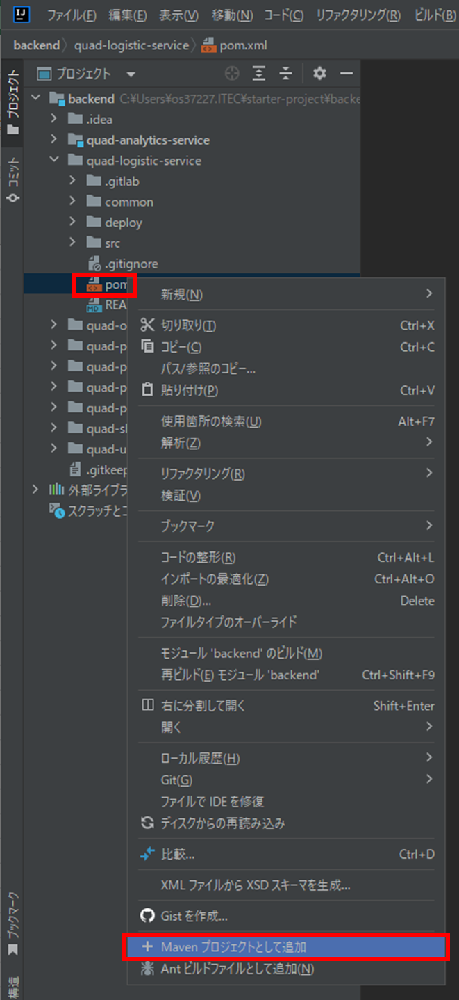

各プロジェクトのpom.xmlを右クリック → 「Maven」 → 「ソースの生成とフォルダーの更新」を選択  
> ※全プロジェクトで実施

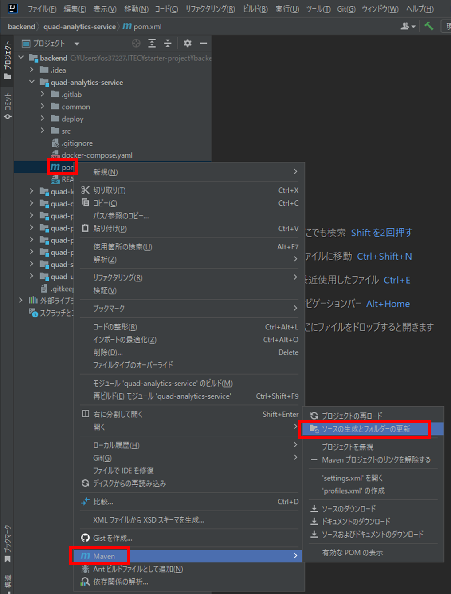

ビルドエラーが発生していないことを確認

---

### VM引数追加

#### 背景

- GMOのライブラリーがJava11に正式対応しておらず、Java11環境下では一部エラーが発生する
- Java8環境下で生成したライブラリを一部参照させることでこれを回避する
- 該当箇所は「決済サービス」のみなので、設定は「hclabo-payment-service」だけでOK  
- 正しく設定できたかどうかは、動作検証時に3Dセキュア決済が利用できるかで確認する

#### 設定手順

「hclabo-payment-service」配下の「PaymentServiceApplication.java」ファイルを右クリックして「実行構成を編集」を開く

「オプションの変更」＞「VMオプションの追加」からVMオプションの入力フォームを追加する

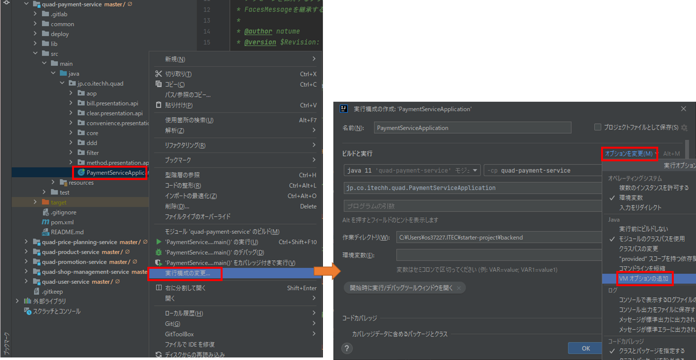

下記設定を変更

- 追加されたフォーム：　`--patch-module=jdk.unsupported=lib/rt-0.0.1-SNAPSHOT.jar`を入力
- 作業ディレクトリ　：　クローンした「hclabo-payment-service」のパス
    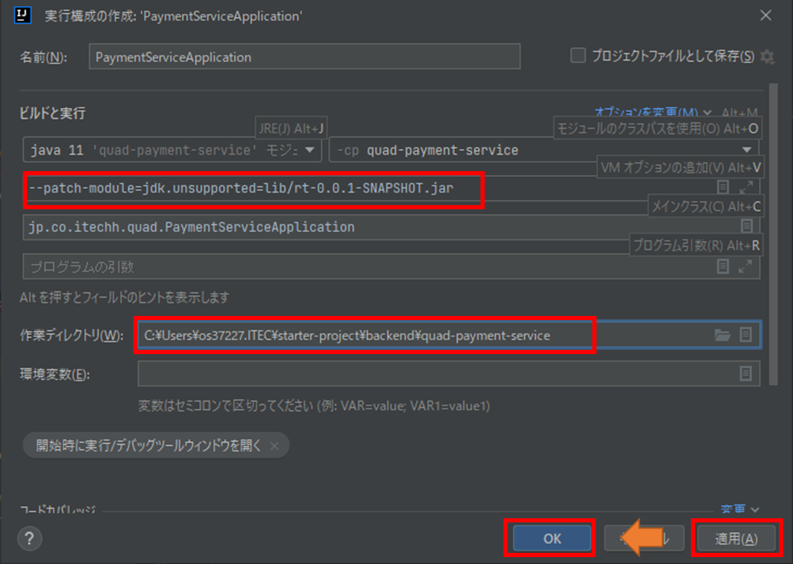

---

### エンコード設定変更

ファイル ＞ 設定 ＞ ファイルエンコーディングを開き、文字コードを変更する
> ※ frontend、backendの両方で実施

- java
    - UTF-8
- resource
    - ISO-8859-1  
        - UFT-8ではアプリが送信するメールが文字化けする
- グローバルエンコーディング、プロパティファイルのデフォルトエンコード
    - UTF-8  
        - ※SO-8859-1のではプロパティファイル等が文字化けする
        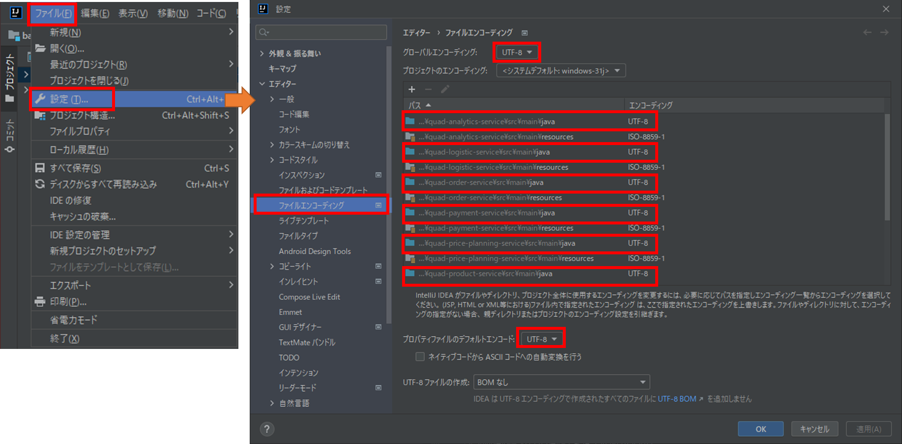

---

### hotdeploy設定

#### 概要

- 開発中、コード修正後にTomcat再起動なしでの反映を可能とする
- ソースの修正保存後少し時間をおいてからリロードが走るため、即座に反映されるわけではないため注意

#### 設定手順

- ファイル ＞ 設定 ＞ ビルド、実行、デプロイ ＞ コンパイラーを開き、下記設定を選択
    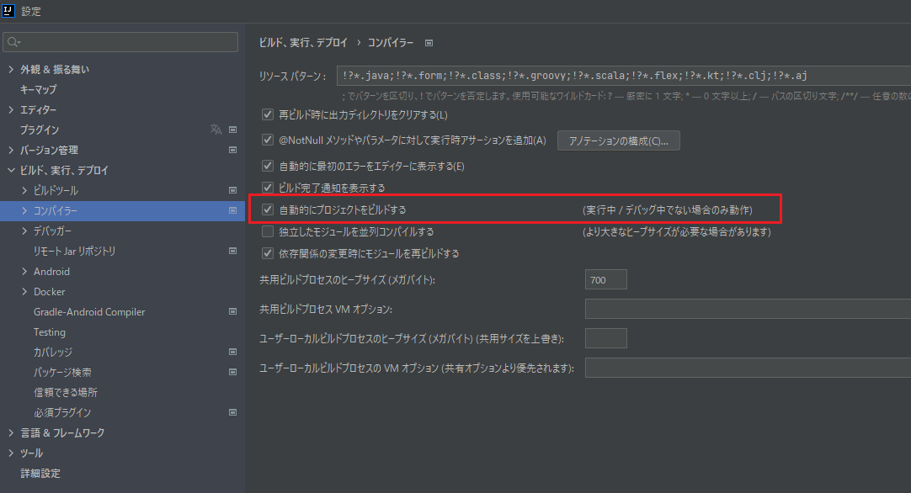

- ファイル ＞ 設定 ＞ 詳細設定を開き、下記設定を選択
    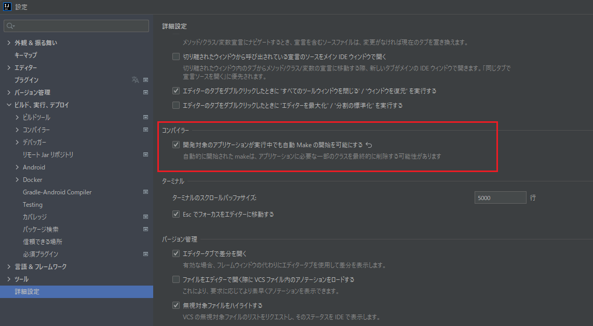

## ■IntelliJ プラグイン追加

### 日本語化プラグイン

#### 導入手順

- IntelliJの設定メニュー＞プラグインより「japanese」を検索し、プラグインをインストールする
    - プラグイン名「Japanese Language Pack / 日本語言語パック」
        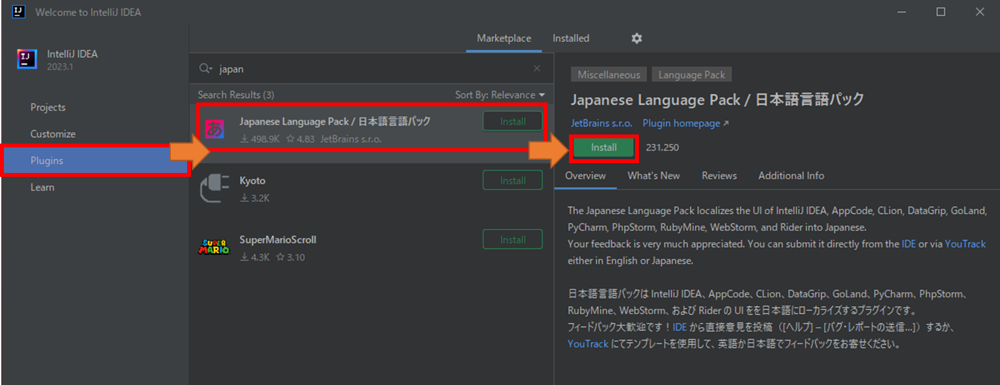
- IntelliJを再起動する

---

### GitToolBoxプラグイン

#### プラグイン紹介

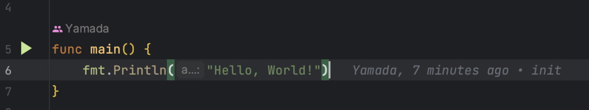

- 上記画像のようにエディター上のコードブロックや、選択行右側にCommitのAuthor名やCommitメッセージが表示されるようになる
- 定期的に自動でgit fetchを実行してくれるようになる

#### 導入手順

- IntelliJの設定メニュー＞プラグインより「GitToolBox」を検索し、プラグインをインストールする
    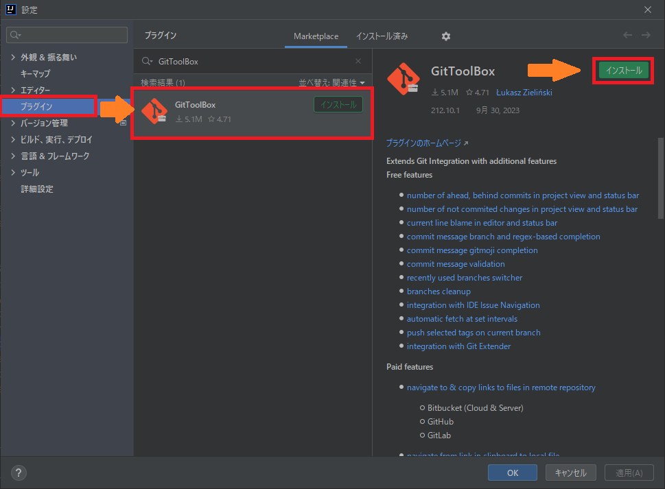

- IntelliJを再起動する

---

### Dockerプラグイン

#### プラグイン紹介

- IntelliJからDockerをGUIで管理できるようになる
    - 起動、停止、log表示、inspect表示、コンテナー内部のファイル確認、docker内部に入る（exec）などの操作が可能
- DockerをWSL上で起動させている場合でもTCPソケットを利用して管理可能（導入手順はこちらで記載）

#### 事前準備

- DockerデーモンをTCP接続可能とする（WSLで実施）  
`/etc/systemd/system/multi-user.target.wants/docker.service` をvimで開き、以下の通りに編集する。

    ``` shell
    # WSLターミナル

    sudo vi /etc/systemd/system/multi-user.target.wants/docker.service
    ```

    ```
    # 編集内容

    【編集前】ExecStart=/usr/bin/dockerd -H fd:// --containerd=/run/containerd/containerd.sock
    【編集後】ExecStart=/usr/bin/dockerd -H tcp://0.0.0.0:2375 -H fd:// --containerd=/run/containerd/containerd.sock
    ```

- Dockerデーモンを再起動する（WSLで実施）
    ``` shell
    # WSLターミナル

    sudo systemctl daemon-reload
    sudo systemctl restart docker
    ```

- TCPポートを確認する（WSLで実施）
    ``` shell
    # WSLターミナル

    ss -tnl | grep 2375
    LISTEN   0         128                       -:2375                   -:- 
    ```
    - 「2375」ポートが利用可能であること

#### 導入手順

-  IntelliJの設定メニュー＞プラグインより「Docker」を検索し、プラグインをインストールする

    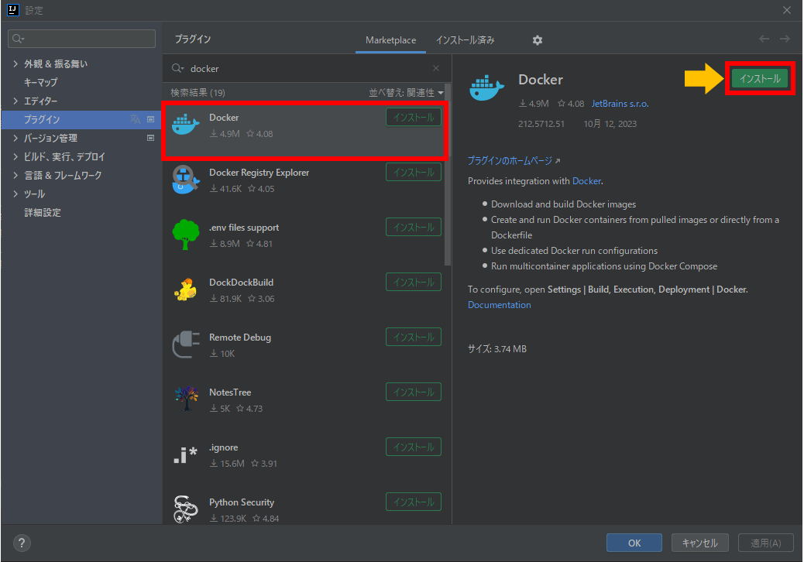

- ファイル　＞　設定　＞　ビルド、実行、デプロイ　＞　Docker　を開き、「＋」ボタンをクリックする

    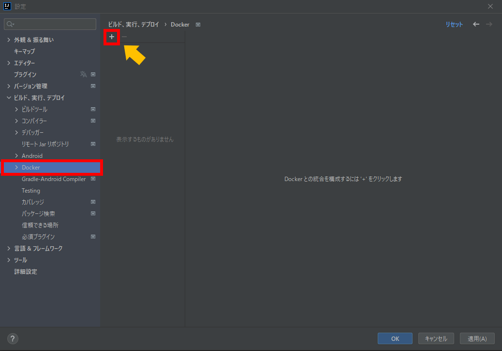

- Dockerデーモンへの接続方法を設定する

    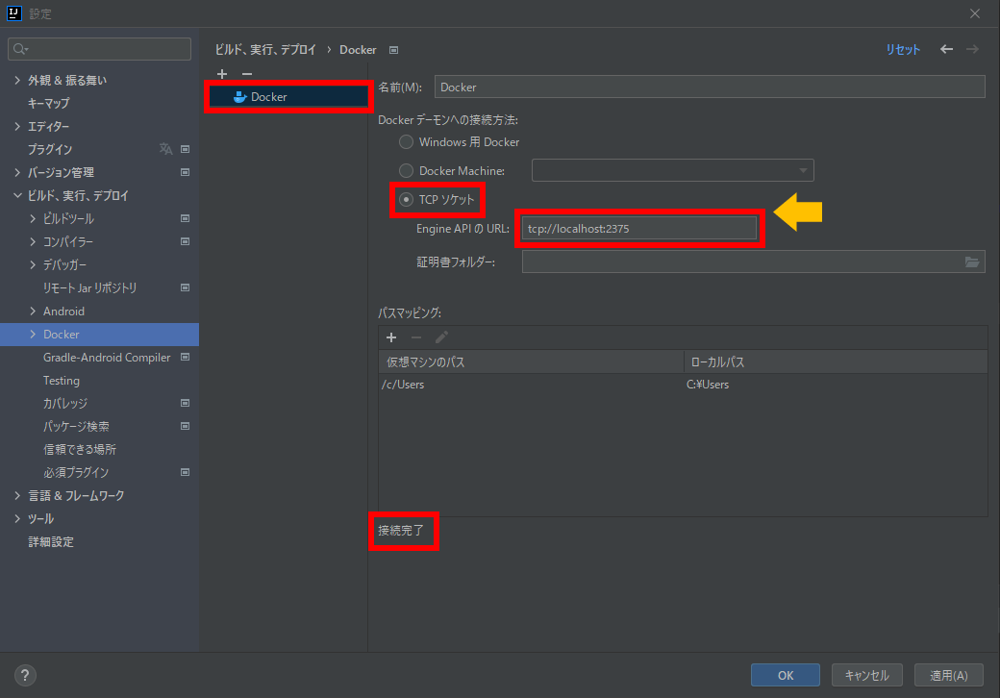

    - TCPソケットを選択し、EngineAPIのURLに `tcp://localhost:2375` を入力する
    - （キャプチャの赤枠以外の項目は未設定（初期値）で良い）
    - 「接続完了」になることを確認する（エラーの場合は、ポートの読み込みに失敗しているため再起動する）

- 表示　＞　ツールウィンドウ　＞　サービス　を選択すると、サービスが表示される

    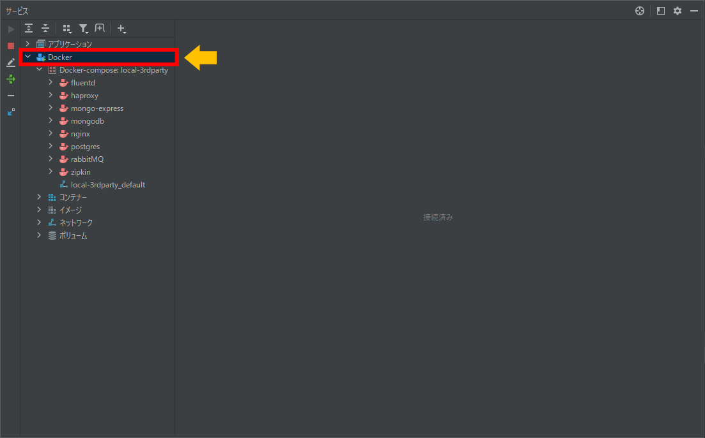

    - 「Docker」をダブルクリックすると接続を開始し、コンテナー情報を展開する
    - 接続エラーの場合は、ポートの読み込みに失敗しているため、IntelliJを再起動する

## ■アプリ起動（初回）

### 起動

- 各プロジェクトの「XxxApplication」ファイルを右クリックして、main()を実行
> ※初回は個別で一つずつ起動していく必要あり

    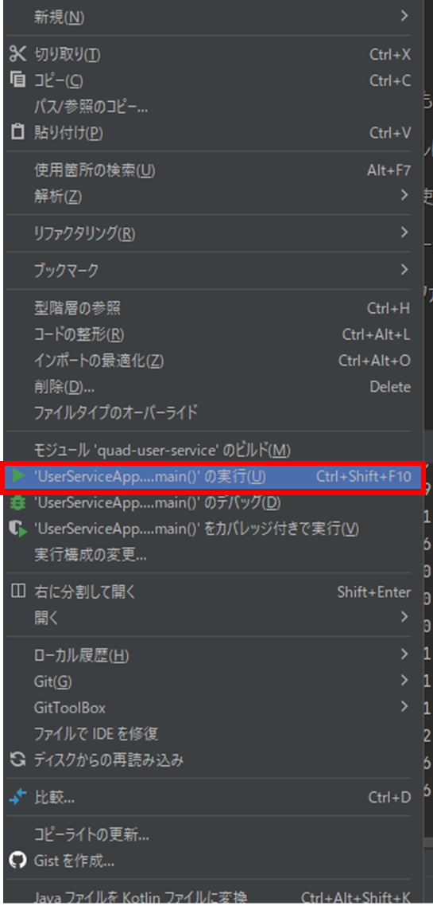

- 全て起動できたら下記にアクセスできることを確認
    - フロント　　：　[https://localhost/](https://localhost/)
    - 管理　　　　：　[https://localhost/admin/login/](https://localhost/admin/login/)　（demoadmin/password）
    - MongoDB  　   ：　[https://localhost:60001/](https://localhost:60001/)
    - RabbitMQ　 ：　[https://localhost:60002/#/](https://localhost:60002/#/)　（rabbitmq/rabbitmq）
    - Zipikin  　  　     ：　[https://localhost/zipkin/](https://localhost/zipkin/)
    - smtp4dev 　：　[https://localhost:60003/](https://localhost:60003/)
    	- SpringSecurityの自動HSTS付与機能の影響回避のため、smtp4devを起動する際に下記パラメーターを追記する
            ``` 
            --urls=http://-:5000
            ``` 
- セキュリティ警告が出た場合
	- 「ドメインネットワーク」のみをチェックして、「アクセス許可」をする
    
        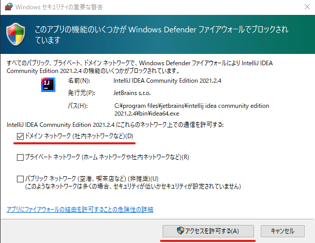


- 簡単に動作確認しておく
    - 商品登録（管理）　・・・　画像アップロードも試しておく　　　 ※上記「■ディレクトリ作成」の確認用
    - 会員登録（フロント）
    - 注文（フロント）　・・・　カード番号「4100000000005000」　※上記「■VM引数追加」の確認用
    - 受注修正（管理）
    - 出荷（管理）
    - 受注売上集計（管理）

## ■アプリ起動（2回目以降）

### サービスによる一括起動

表示　＞　ツールウィンドウ　＞　サービス　を選択すると、画面下部にサービスが表示される

> 一度実行した「XxxApplication」がサービスメニュー内に表示される  
> 表示されない場合は下記キャプチャのとおり、アプリケーションを押すと表示されるようになる

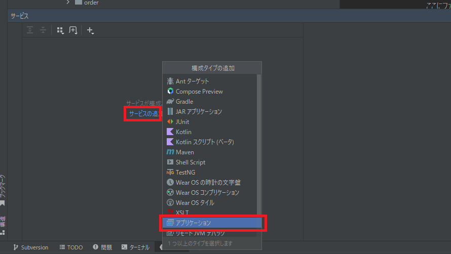  

「アプリケーション」or「未始動」を選択した状態で、右クリックで 実行 or デバッグ を選択して一括起動が可能（左端のアイコン押下でも可能）  

また「XxxApplication」自体を選択した状態ならば、アプリ単位の実行 or デバッグも可能。  

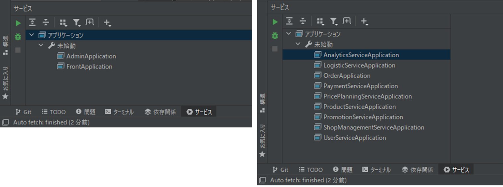

## ■注意事項

### IntelliJアプリケーション設定の保存

IntelliJの設定によっては、IntelliJを閉じると一部の起動アプリ（XxxApplication）がサービス欄に表示されなくなることがある

その場合、各「XxxApplication」に対して「実行構成の編集」を開き、「プロジェクトファイルとして保存」を押下することでIntelliJが記憶してくれる

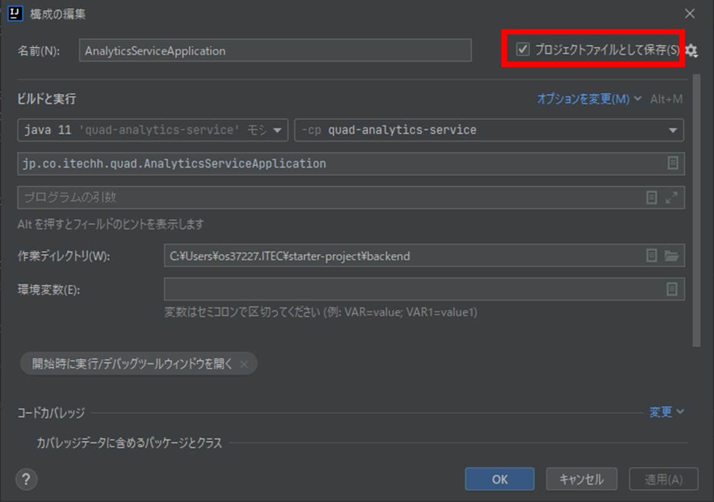

---

### 有線/無線/在宅勤務の切り替えによるIPアドレスの再設定

有線/無線/在宅勤務の切り替えによって、フロントや管理にアクセスできなくなった場合は、IPが変わっているので下記をubuntu プロンプト上で行う。

``` shell
# WSLターミナル

docker compose up -d nginx
docker compose up -d haproxy
```

## 参考資料

- [IntelliJで他プロジェクトをモジュールとして参照する方法](https://e4-odessa.itechh.ne.jp/60b8331da8b5fb0049fba307)
- [intellij設定とショートカット](https://e4-odessa.itechh.ne.jp/622030c9a8b5fb0049fc9ce6)
