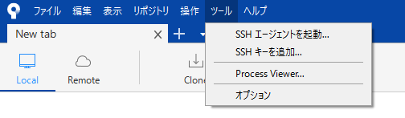
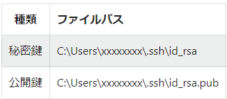
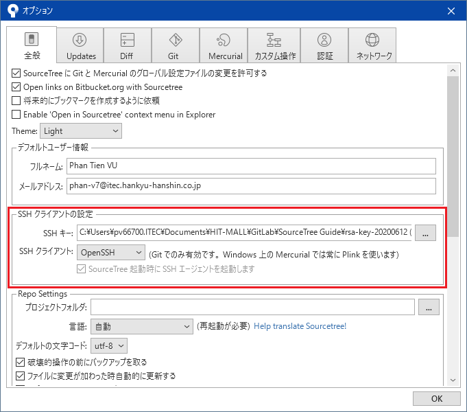
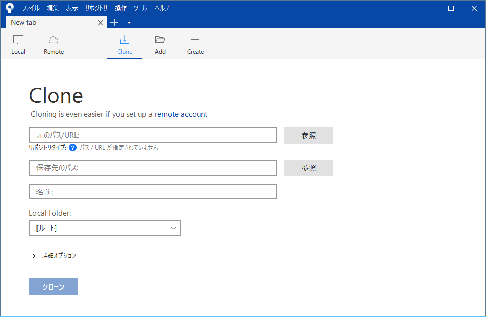
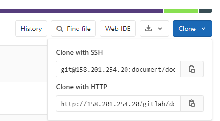
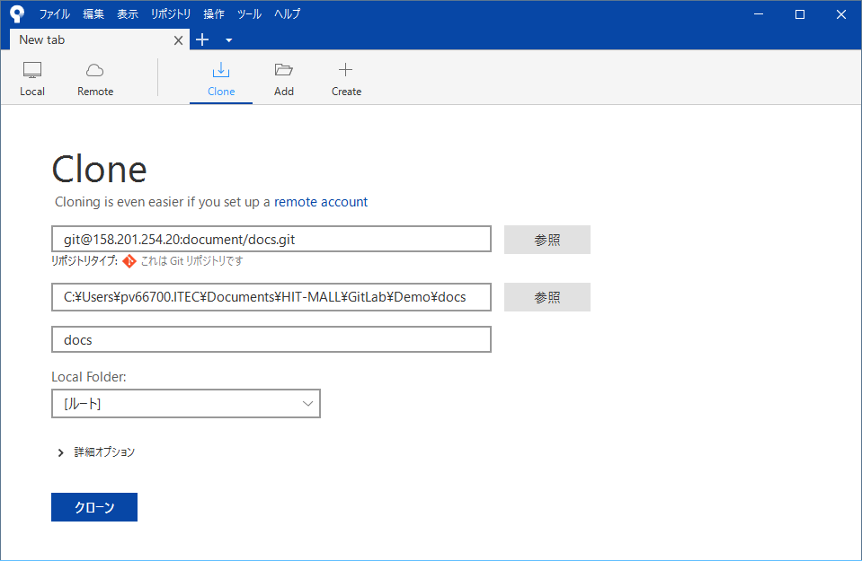
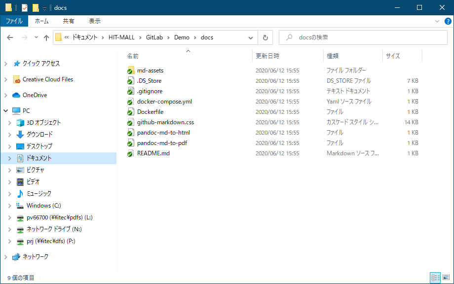
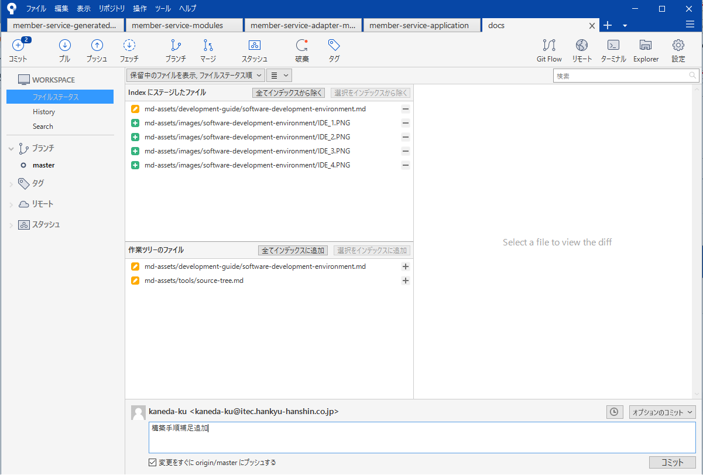

# SourceTree初期設定ガイド

## SourceTreeインストール

以下のURLよりツールをダウンロードし、インストールする

 [SourceTree - Git GUI Tool](https://www.sourcetreeapp.com/)（Atlassianアカウント作成は不要）

## 初期設定手順

### SourceTreeでのOpenSSHキー追加
> GitlabへHTTPSで接続する場合は実施不要(e4-vcs.itechh.ne.jpサーバなど)

[GitlabへのSSH Key登録](../01/01_GitlabへのSSH Key登録.md)で生成されたSSHキーをSourceTreeに追加する

Menuバーから「ツール／オプション」をクリックし、OpenSSHキーを設定する

- SSHキー：公開鍵の配置場所
- SSHクライアント：OpenSSHを選択

## GitLabへの接続確認

ツールバーで「Clone」ボタンをクリックする

クローン対象リポジトリのGitリンク先を取得する

今回は「Clone with SSH」を使用しているため、上の「git@...」リンクをコピーする

以下のように各情報を指定し、「クローン」ボタンをクリックする

1. 元のパス（クローン対象リポジトリのGitリンク先）
2. 保存先のパス（Localフォルダー）
   - ※事前に作成する必要があり、GitLab上のプロジェクト名称と一致するように設定する
3. 詳細オプションを展開し、チェックアウトするブランチを指定する

クローンされたリポジトリを確認する

## 【補足】GitLabへのコミット/プッシュ

ソースを修正完了後、GitLabへのコミット/プッシュは、SourceTreeから行う

