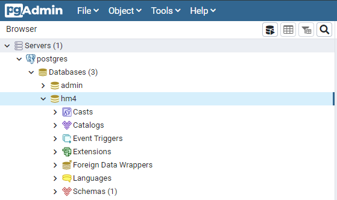

# 開発補助ツール導入

## ■目次
1. intelljのインストール（必須手順）
2. SourceTreeのインストール（任意手順）
3. DB接続クライアントのインストール（任意手順）

## ■IntelliJのインストール（必須手順）

[IntelliJでのプロジェクト設定](./04/01_IntelliJでのプロジェクト設定.md)

## ■SourceTreeのインストール（任意手順）

SourceTreeはGitの操作ができる無料のデスクトップアプリケーション

以下のリンク先を参考にインストールする

[SourceTree初期設定ガイド](./04/02_SourceTree初期設定ガイド.md)

## ■DB接続クライアントのインストール（任意手順）

### A5M2ツール
A5:SQL Mk-2は高機能なDBクライアントツール

以下のリンク先を参考にインストールする

https://a5m2.mmatsubara.com/

#### 接続設定
* A5M2ツールを起動し、メニューバーから「データベースの追加と削除（D）」を選択する
* 以下の画面で「追加」ボタンをクリック（or ショートカット`Alt+A`）
  
* PostgreSQL（直接接続）を選択する（or ショートカット`Alt+P`）
* 以下の情報を入力する
  * サーバ名：localhost
  * データベース名＆ユーザーID：hclabo_xxxx （※xxxxは各サービスごとに異なる）
    * hclabo_logistic
    * hclabo_order
    * hclabo_payment
    * hclabo_price_planning
    * hclabo_product
    * hclabo_promotion
    * hclabo_shop_management
    * hclabo_user  
    * hclabo_customize  
    * パスワード：password
      > ※hclabo_analyticsはMongoDBなので存在しない
  - 設定例）
    - 
    
  * 入力完了後に「テスト接続」ボタンをクリックし、以下のメッセージが表示されたらOK
    - 
  * 最後に「OK」ボタンをクリックする

* `hclabo_logistic`データベースに接続する
  * 左パネルにある`hclabo_logistic`をダブルクリックして、以下の情報を入力し、接続ボタンをクリックする
    * ユーザーID：hclabo_logistic
    * パスワード：password
      - 
  * 以下のような画面が表示されたらOK
      - 

### PgAdminツール

以下のリンク先からダウンロードし、インストーラーにしたがってインストールする
  
https://www.pgadmin.org/download/pgadmin-4-windows/

#### 接続設定
* 左パネルにある`Servers`を右クリックし、`Create > Server...`を選択する
    - 
* 以下の画面にDBのアクセス情報を設定しDBサーバに接続する
  - DBのアクセス情報は、上記A5M2ツールでの説明参照
  - キャプチャはhm4だがhclabo_xxxxで接続すること
    - 
    - 
* 「Save」ボタンをクリックし以下のようにVer4データベースが表示されたらOK
    - 

  
---
前の手順ファイル：[HIT-MALL Ver4初期設定](./03_HIT-MALL Ver4初期設定.md) 
次の手順ファイル：[HIT-MALL Ver4初期データ登録](./05_HIT-MALL Ver4初期データ登録.md)

