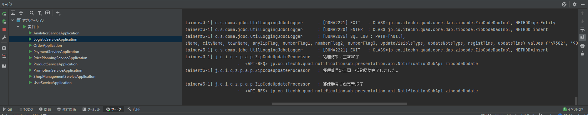

# HIT-MALL Ver4初期データ登録

## ■目次

1. 登録準備
2. 郵便番号データ初回取り込み
3. 事業所郵便番号データ初回取り込み

## ■登録準備

最低限以下サービスを起動しておく
- hclabo-app（管理サイトのバッチ結果見るため）
- 分析サービス（管理サイトのバッチ結果見るため）
- ユーザーサービス（メール確認用）
- 物流サービス（バッチ本体）
- fluentd

## ■郵便番号データ初回取り込み

コマンドプロンプトにて、以下コマンドを実行する
```
# コマンドプロンプト

curl -X POST -H "Content-Type: application/json" -d "{\"allFlag\":true, \"startType\":\"0\"}" http://localhost:8680/logistic-service/shippings/zipcode-update
```

## ■事業所郵便番号データ初回取り込み
上記「■郵便番号データ初回取り込み」手順が完了していること
> intelljのイベントログにて、郵便番号データ取り込み処理が終わっていることを確認する

	

コマンドプロンプトにて、以下コマンドを実行する

```
# コマンドプロンプト

curl -X POST -H "Content-Type: application/json" -d "{\"allFlag\":true, \"startType\":\"0\"}" http://localhost:8680/logistic-service/shippings/officezipcode-update
```

環境によるが、郵便番号自動更新バッチ約6分、事業所郵便番号自動更新バッチ約1分30秒ほどで完了

<br><br>
---
前の手順ファイル：[開発補助ツール導入](./04_開発補助ツール導入.md)

