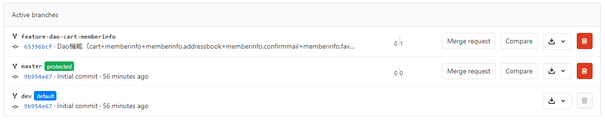
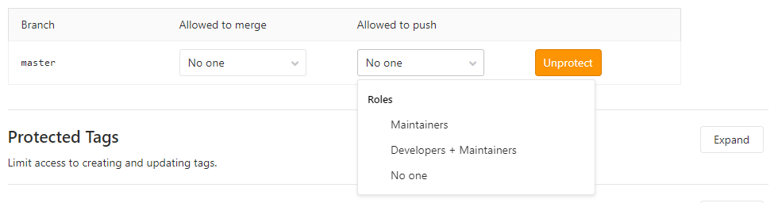
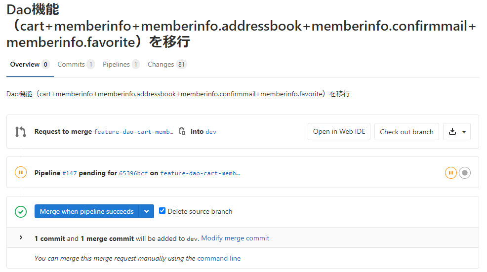
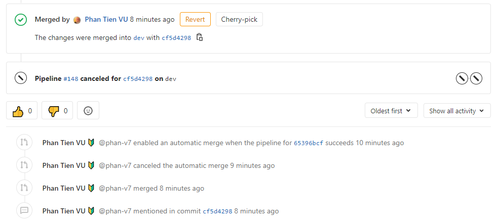
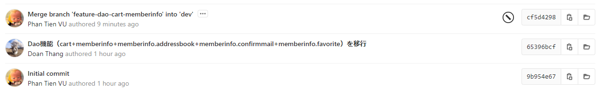

# Dao本格移行ではじめてQUADのGitLabフローを活用したメモ

## ■QUADのGitLabフロー定義書

https://docs.google.com/presentation/d/1zXlwRmE3Dogr5-GJW_oab5q6qhV4vjH4ExGNsFyE42U/edit?usp=sharing

## ■実現ステップ

* GitLab上で`hm4-core`レポジトリを新規作成し、このタイミングに`master`ブランチが自動生成される
* `master`ブランチから`dev`ブランチを新規作成する
* `dev`ブランチから`feature-dao-cart-memberinfo`ブランチを切って、開発したソースコードをこちらにコミット・プッシュする
* `feature-dao-cart-memberinfo`ブランチから`dev`ブランチへのマージリクエストを作成し、チームリーダーにレビュー・承認依頼を送信する
* チームリーダーにてレビューを行い、問題なければマージリクエストを承認する
* `dev`ブランチにマージしたソースコードが反映されていることを確認する

## ■重要な画面キャプチャー

各種ブランチ構成のイメージ

`master`ブランチは基本的は開発メンバーが直接操作できないため、マージ・プッシュ等は不許可とする

`feature-dao-cart-memberinfo`ブランチから`dev`ブランチへのマージリクエスト

マージした結果

